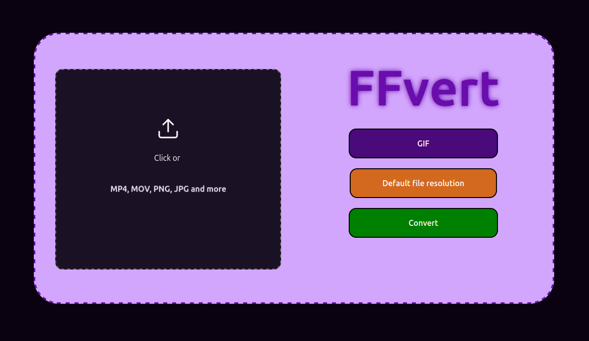
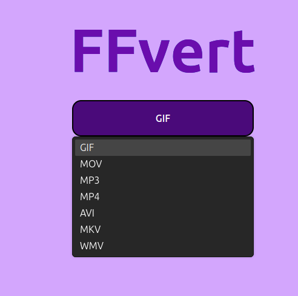
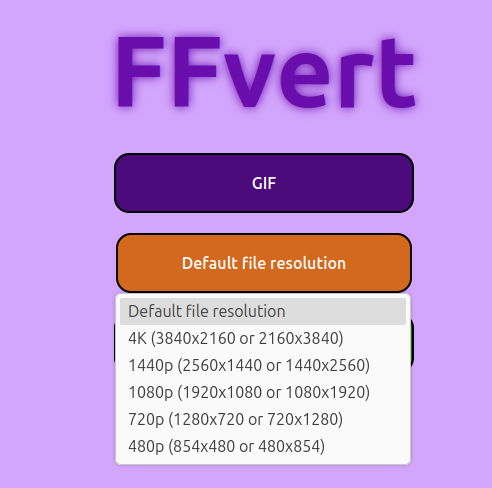
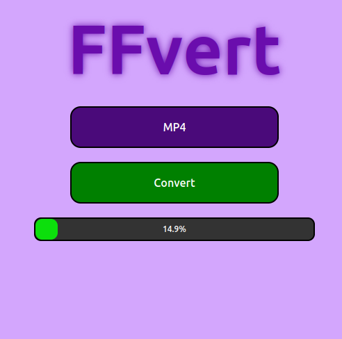
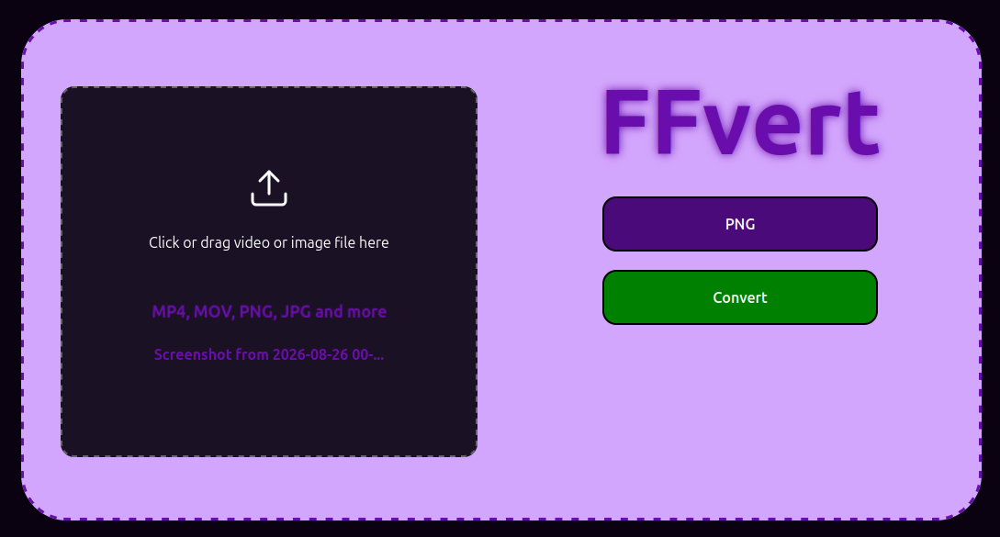
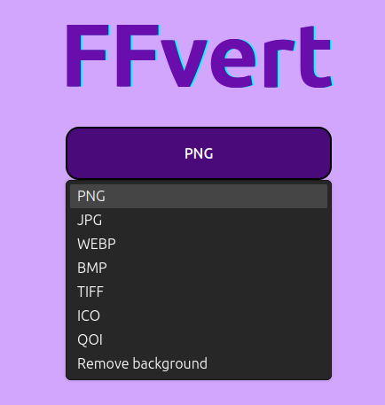
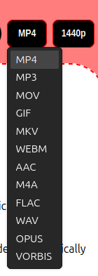

# FFvert

A simple web app for converting video and image files, and downloading YouTube videos.

## Features

## Video Conversion



1. Upload your video file.
2. Select video format.



3. Select video resolution.



4. Click `Convert` and wait for convert finish.



---

## Image Conversion



1. Upload your image file.
2. Select image format or the `Remove background` option.



3. Click `Convert` and wait for finish.

---

## YouTube Video Downloader


1. Paste your YouTube video film (YouTube shorts video is supported).
2. Select format and resolution.



3. Click `OK` and wait for your video file.

--- 

## FFvert supported video formats and resolution

| Format | Extension |
|---|---|
| GIF | `.gif` |
| QuickTime | `.mov` |
| MP3 (audio only) | `.mp3` |
| MP4 | `.mp4` |
| AVI | `.avi` |
| Matroska | `.mkv` |
| Windows Media Video | `.wmv` |

Available target resolutions: **4K, 1440p, 1080p, 720p, 480p**.

---

## FFvert supported image formats
| Format |
|---|
| `.png` |
| `.jpg`|
| `.webp` |
| `.bmp`|
| `.tiff` |
| `.ico` |
| `.qoi` |


---

## FFvert image background remove system
Image background remove system based on `@imgly/background-removal-node` package. The AI model `isnet_fp16` is downloaded of `IMG.LY` servers and runs locally.

---

## YouTube video downloader
YouTube Downloader is base on `youtube-dl-exec` package. The file is downloaded and converted using `FFmpeg` for user selected format and resolution.

## Installation

```bash
git clone https://github.com/Nahida4479/FFvert.git
cd FFvert
npm install
```

## Running the app

```bash
node app.js
```

Then open your browser at:

```
http://localhost:3003
```
## Requirements
- Node.js
- Python 3.9+ (required by `youtube-dl-exec`)